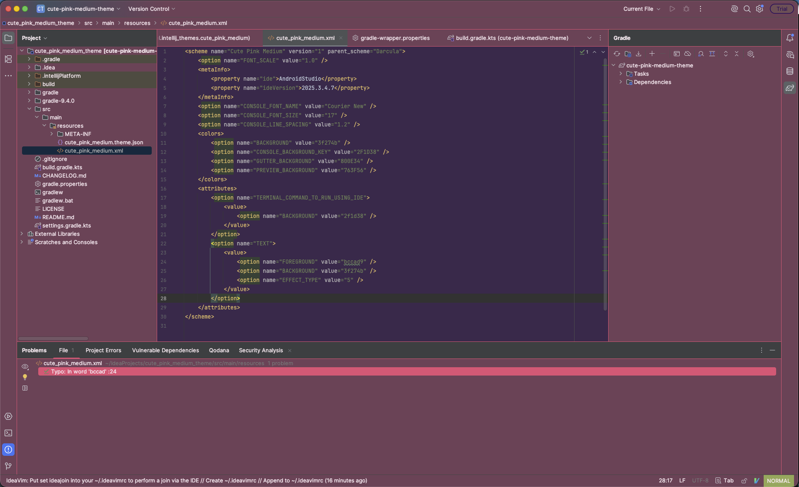

# Cute Pink Medium Theme

<!-- Plugin description -->
The Cute Pink Medium Theme is a modified version of the [Cute Pink Dark Theme](https://plugins.jetbrains.com/plugin/20367-cute-pink-dark-theme), which brightens some of the darker elements for a more balanced look; not too dark, not too bright.  Like the original, this is compatible with JetBrains IDEs.

## Installation

### Install from JetBrains Marketplace

1. Open **Settings / Preferences** in your IDE.
2. Go to **Plugins**.
3. Select the **Marketplace** tab.
4. Search for **Cute Pink Medium Theme**.
5. Click **Install**.
6. Restart the IDE when prompted.
7. Go to **Settings / Preferences → Appearance & Behavior → Appearance**.
8. Select **Cute Pink Medium** from the **Theme** dropdown.

The theme works in IntelliJ IDEA, Android Studio, and other JetBrains IDEs.

## Screenshot

